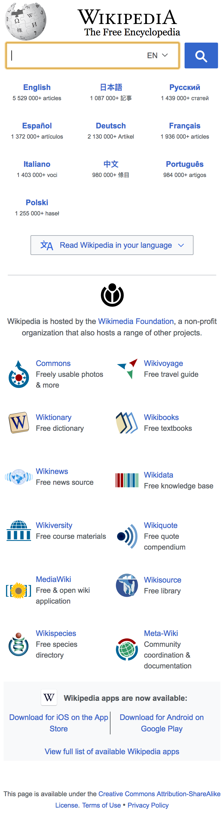

# terminal-puppeteer-screenshot

Capture full-height screenshots of web pages from a terminal interface.
Powered by [Puppeteer](https://github.com/GoogleChrome/puppeteer) headless Chrome Node API and configured with options.

## Example
```
node screenshot.js capture --siteurl=https://www.wikipedia.org/ --viewport='iPhone 6'
```



Will place a full height png screenshot of the site on the specified device in the `/Screenshots`folder.

## Setup
1. **Install [Node](https://nodejs.org)**
2. **Install [Git](https://git-scm.com/downloads)**
3. **Clone the project**. `git clone https://github.com/sbtn/terminal-puppeteer-screenshot.git`
3. **Install the dependencies**. `npm install`

The Puppeteer dependency includes a system specific build of chromium (~70-110mb depending on OS).

## Usage
In terminal from the project directory:
```
node screenshot.js capture --siteurl=<siteurl> --viewport=<viewport>
```

Where `<viewport>` can be a specific pixel dimension:

```
node screenshot.js capture --siteurl=https://www.wikipedia.org/ --viewport=1024x768
```

Or by specifying a device:

```
node screenshot.js capture --siteurl=https://www.wikipedia.org/ --viewport='iPad landscape'
```

For a list of available devices try the `devices` option:

```
node screenshot.js --devices
```

## Notes
- So far only tested in the MacOS terminal.
- This is a fun exploration of only one of the many powerful features in [Puppeteer](https://github.com/GoogleChrome/puppeteer).
